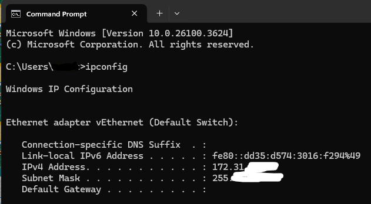
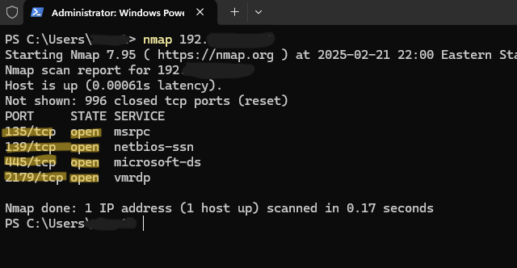
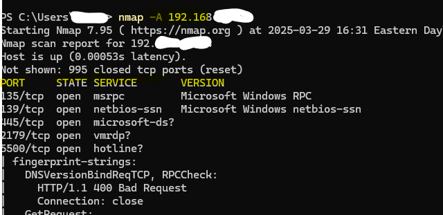

# Network-Scanning-and-Analysis

## Table of Content
1. [Introduction](#introduction)
2. [Tools Needed](#tools-needed)
3. [Overview Of Tools](#overview-of-tools)
4. [Conclusion](#conclusion)

## Introduction

Network Scanning and Analysis" is a cybersecurity project focused on gaining practical experience with network assessment techniques. 
This project documents the process of using Nmap to map network layouts, identify active hosts and services, and detect open ports. 
Furthermore, it incorporates Wireshark to analyze network traffic, providing a deeper understanding of network communication and potential security loopholes. 
The findings of this project illustrate the importance of proactive network security measures.

## Tools Needed

- Network Mapper **(Nmap)**
  [Download Here!](https://nmap.org/download.html)
- Wireshark
  [Download Here!](https://www.wireshark.org/download.html)

## Overview Of Tools

### Network Mapper (Nmap)
- **Background**
    - Nmap is a powerfull open source network scanner for host discovery, service and opeating system detection, and security auditing. It works by sending
      variouse packets to target hosts and analyzing the responses. Nmap is highly versatile and supports numerous scanning technique, including
      TCP SYN scans, UDP scans, and OS fingerprinting.

- **How it Works**
    - Nmap sends specially crafted packets to target hosts. The responses from the hosts reveal information about their open ports, running services, and operating systems.
      Different scan types use different packet types and techniques to achieve specific goals. For example, a SYN scan sends SYN packets and analyzes the SYN/ACK oe RST
      responses to determine open ports.

#### Step by Step Process**
I prefere using the command line interface **(CLI)** rather than the Graphic User Interface **(GUI)**.
- **Step 1** 
   on a Windows systems, typing **ipconfig** will display your IP Address. 
   
   

- **Step 2** 
Using the command **namp "IP Address here"**. Use your IP address from the ipconfig. 
This will show you basic stuff like an open port and its protocols. 

   

- **Step 3** 
If you want to see more details, type the command **nmap - A "IP Address here"**. 
This scan will give you the OS, its version, script scan, and traceroute. 

    
   
**Note**, we could type **nmap -h** to see the help page of how to use nmap and all the options we could use **(-sV, -sC, -A, etc)**. 

### Wireshark
- **Background**
    - To truly understand network behavior, look at the raw data. That's where Wireshark comes in. This project utilizes Wireshark, a widely used network protocol analyzer, to capture and analyze network packets.
      By examining this data, I can identify communication patterns, detect anomalies, and gain a deeper understanding of how devices interact on the network.
      This analysis can be crucial for identifying security vulnerabilities and optimizing network performance..

- **How it Works** 
    - Wireshark **captures** network **packets** by putting the network interface card (NIC) into promiscuous mode, allowing it to see all traffic.
      It then decodes the packets and displays them in a user-friendly format, showing protocol headers, data payloads, and other
      relevant information. It uses **filters** to view only certain types of traffic and then **analyze** the communication between the different devices.

#### Step by Step Process**
